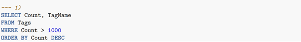
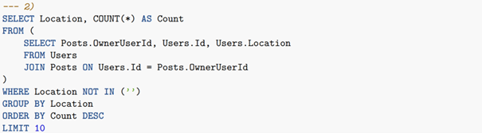
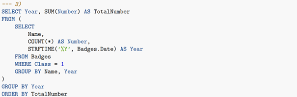
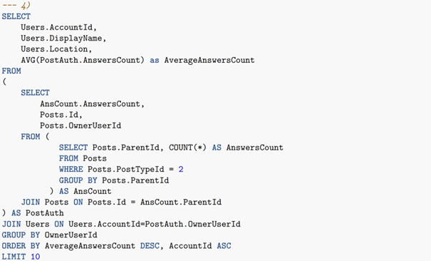
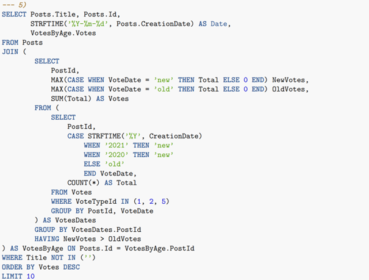

```{r setup, include=FALSE}
knitr::opts_chunk$set(
	echo = TRUE,
	message = FALSE,
	warning = FALSE,
	cache = TRUE
)
```

# PDU 2021/2022
# Praca domowa nr 2


```{r echo = FALSE, cache = FALSE}
# Załączam potrzebne pakiety i ramki, zamiast stosowania source
library("sqldf")
library("dplyr")
library("data.table")
library("microbenchmark")
Badges <- read.csv("travel_stackexchange_com/Badges.csv.gz")  # odczytujemy ramki danych
Comments <- read.csv("travel_stackexchange_com/Comments.csv.gz")
PostLinks <- read.csv("travel_stackexchange_com/PostLinks.csv.gz")
Posts <- read.csv("travel_stackexchange_com/Posts.csv.gz")
Tags <- read.csv("travel_stackexchange_com/Tags.csv.gz")
Users <- read.csv("travel_stackexchange_com/Users.csv.gz")
Votes <- read.csv("travel_stackexchange_com/Votes.csv.gz")
```


Raport służy pokazaniu, jak wykonać polecenia SQL podane poniżej za pomocą:

1. sqldf::sqldf();

2. tylko funkcji bazowych;

3. dplyr;

4. data.table,

a następnie porównaniu czasu wywoływania się tych funkcji dla danego zadania.

## Ramki danych
Będę pracował na uproszczonym zrzucie zanonimizowanych danych z serwisu <https://travel.stackexchange.com/>, który składa się z następujących ramek danych:

* Badges.csv.gz

* Comments.csv.gz

* PostLinks.csv.gz

* Posts.csv.gz

* Tags.csv.gz

* Users.csv.gz

* Votes.csv.gz


Znaczenie poszczególnych kolumn w podanych ramkach znajdziemy tutaj:  <https://ia600107.us.archive.org/27/items/stackexchange/readme.txt>.

Poniżej zaprezentuję podane polecenia w języku SQL, wytłumaczenie tych poleceń oraz funkcje, które je wykonują (których dokładniejszy opis co robi funkcja w danym momencie znajduje się w pliku o rozszerzeniu R - by raport był czytelniejszy). Wynik funkcji bazowych, pakietu dplyr i data.table będziemy porównywać z wynikiem funkcji sqldf, ponieważ polega ona tylko na przepisaniu polecenia SQL, więc oczywiście jest poprawna.

## Zadanie 1
Mamy polecenie podane w języku SQL:




Musimy wybrać z ramki "Tags" kolumny Count i Tagname, gdzie Count > 1000.
Następnie ustawiamy nasze wiersze tak, by kolejne wartości z Count było malejąco.

a) rozwiązanie przy pomocy pakietu sqldf


```{r echo = TRUE}
df_sql_1 <- function(Tags){
  stopifnot(is.data.frame(Tags))
  sqldf("SELECT Count, TagName
      FROM Tags
      WHERE Count > 1000
      ORDER BY Count DESC")
}
```

Po wywołaniu takiego polecenia otrzymujemy taką ramkę (wypiszemy kilkanaście pierwszych wierszy):

```{r}
df_sql_1(Tags)
```


b) rozwiązanie za pomocą tylko funkcji bazowych

```{r echo = TRUE}
df_base_1 <- function(Tags){
x <- na.omit(Tags[Tags$Count > 1000, c("Count", "TagName")])
x <- x[order(x$Count, decreasing = TRUE),]
rownames(x) <- NULL
x
}
```

c) rozwiązanie za pomocą pakietu dplyr
```{r echo = TRUE}
df_dplyr_1 <- function(Tags){
a1 <- Tags %>% arrange(desc(Count))
a2 <- select(a1, Count, TagName)
a3 <- a2 %>% filter(Count > 1000)
a3
}
```

d) rozwiązanie za pomocą pakietu data.table

```{r echo = TRUE}
df_table_1 <- function(Tags){
Tag_1 <- data.table(Tags)
ans <- Tag_1[, .(Count, TagName)]
ans <- ans[order(-Count)]
ans <- ans[with(ans, Count>1000)]
ans
}
```


Sprawdzimy, czy wszystkie nasze funkcje zostały napisane poprawnie
```{r echo = TRUE}
dplyr::all_equal(df_sql_1(Tags), df_base_1(Tags))
dplyr::all_equal(df_sql_1(Tags), df_dplyr_1(Tags))
dplyr::all_equal(df_sql_1(Tags), df_table_1(Tags))
```

Podane funkcje zwracają TRUE, zatem zostały napisane poprawnie.


### Porównanie czasu wykonania funkcji w zadaniu 1

Żeby to zrobić, potrzebujemy wywołać funkcję microbenchmark, która wywoła każdą funkcję 100 razy. Tabela z porównaniami czasu (minimum, maksimum, średnia, itd.) znajdzie się pod kodem. Poniższe wyliczenia mamy w milisekundach, ponieważ te funkcje bardzo szybko się wykonują.

```{r}
# Zadanie 1 - porównanie czasu

microbenchmark::microbenchmark(
  sqldf = df_sql_1(Tags),
  base = df_base_1(Tags),
  dplyr = df_dplyr_1(Tags),
  data.table = df_table_1(Tags),
  unit = "ms"
)
```

Skupimy się przede wszystkim na maksimum, minimum i średniej czasu wywołania danej funkcji.


* Minimum 

  * Najmniejszy czas wywołania funkcji sqldf to ok 17,4 milisekundy. W dplyr było to ponad 1,5 raza mniej, bo trwało 10 milisekund. W data.table było to jeszcze mniej - niecałe 2 milisekundy. Najlepsza tutaj okazała się funkcja napisana w base, bo najszybciej wywołana funkcja trwała 0.25 milisekundy. Jak widać, są spore rozbieżności - funkcja base jest prawie 70 razy szybsza od sqldf. Trzeba tutaj oczywiście zauważyć, że jest to najbardziej optymistyczny przypadek dla każdej funkcji. Oprócz tego rozważamy milisekundy, co jest naprawdę małą jednostką czasu. Gdybyśmy jednak musieli wywoływać pętle miliardy razy, to wtedy ta różnica faktycznie robi się spora.


* Maksimum

  * Tutaj, podobnie jak w minimum, najdłużej wywołującą się funkcją była sqldf - w najgorszym przypadku trwa 106 milisekund. 2 razy szybciej wykonuje się dplyr, data.table jeszcze szyciej, bo w 13,5 milisekundy. Okazuje się, że base znowu była tutaj najlepsza - bo w najmniej optymistycznym przypadku trwała 7,3 milisekundy.

* Średnia

  * Wnioskując po minimum i maksimum już od razu widzimy, że sqldf była najgorsza, jeżeli chodzi o czas. Średnia czasu wykonania sqldf to ok. 21,5 milisekundy. Druga najszybsza okazuje się dplyr z 12,5 milisekundy. Potem jest data.table ze średnią czasu wywołania równą 2,71 milisekundy. Zatem najlepszą funkcją w przypadku tego polecenia jest base - średnio wywołanie funkcji napisanej za pomocą tylko funkcji bazowych to 0,5 milisekundy.


W tabelce można zauważyć spore rozbieżności między minimalnym czasem wywołania funkcji, a maksymalnym. Rozpatrujemy jednak czas w milisekundach, zatem dla człowieka nie zrobi różnicy, czy funkcja potrwa 106 milisekund, czy 0,25 milisekundy, bo nie jest w stanie dokładnie zmierzyć czasu gołym okiem (bez stosowania funkcji mierzącej). Gdy jednak stosujemy jakąś funkcję w pętli, to wtedy bardzo zalecane jest spojrzeć na średnią czasu wywoływania funkcji i wybrać tę, gdzie czas jest najmniejszy. Generalnie, przy tak krótkim poleceniu, najlepszy jest base.


## Zadanie 2
Mamy dane kolejne polecenie napisane w języku SQL:


W tym i kolejnych zadaniach występują polecenia zagnieżdżone. Zajmiemy się najpierw wykonaniem tych poleceń.
Ramkę Users i ramkę Posts łączymy za pomocą operacji JOIN (a konkretnie INNER JOIN, które polega na wybraniu kolumn z obydwu tabel, które połączymy na podstawie wartości i w ten sposób połączymy obydwie tabele; wiersze z wartościami, które występują w jednej kolumnie, a nie występują w drugiej usuwamy z naszej wynikowej tabeli), łącząc w jedno kolumnę Id z Users i OwnerUserId z Posts. Niech to będzie nowa ramka - nazwijmy ją np. A.

Następnie wybieramy z ramki A kolumnę Location, zliczamy (w kolumnie, którą nazwiemy Count) wszystkie takie lokacje, które nie są w
pojedynczych apostrofach. Potem ten zbiór dzielimy na grupy
(w jednym wierszu jest dana jednej lokacji, a w kolumnie Count ilość jej wystąpienia w całej ramce A). Szeregujemy ten zbiór,
by kolejne wartości z kolumny Count były ciągiem malejącym (a konkretnie nierosnącym). Bierzemy 10 pierwszych wierszy otrzymanej ramki.


a) rozwiązanie przy pomocy pakietu sqldf


```{r}
df_sql_2 <- function(Users, Posts){
  sqldf("SELECT Location, COUNT(*) AS Count
FROM (
    SELECT Posts.OwnerUserId, Users.Id, Users.Location
    FROM Users
    JOIN Posts ON Users.Id = Posts.OwnerUserId
)
WHERE Location NOT IN ('')
GROUP BY Location
ORDER BY Count DESC
LIMIT 10")
}
```

Po wywołaniu takiego polecenia otrzymujemy taką ramkę:

```{r}
df_sql_2(Users, Posts)
```


b) rozwiązanie za pomocą tylko funkcji bazowych

```{r}
df_base_2 <- function(Users, Posts){
x <- merge(Users, Posts,
           by.x ='Id', by.y = 'OwnerUserId', all = FALSE)
colnames(x)[13] <- 'OwnerUserId'  # zamieniam Id.y
x <- x[,c("OwnerUserId", "Id", "Location")]
Baza <-x
# Mamy już ramkę A - jest nią Baza
Baza$Location[which(Baza$Location == "")] <- NA 
x <- as.data.frame( table( Baza[ !is.na(Baza$Location), 
                                   "Location" ] ),
                    stringsAsFactors = FALSE)
colnames(x) <- c("Location", "Count")
rownames(x) <- NULL
x <- x[order(x$Count, decreasing = TRUE),]
head(x,10)
}
```

c) rozwiązanie za pomocą pakietu dplyr
```{r}
df_dplyr_2 <- function(Users, Posts){
a1 <- Posts %>% select(OwnerUserId)
a2 <- Users %>% select(Id, Location)
a3 <- a1 %>% inner_join(a2, by = c("OwnerUserId"="Id"), keep = TRUE)
colnames(a3)
# Zrobiłem join
y <- a3 %>% mutate(Location = replace(Location, Location=='',NA))
a4 <- filter(y, !is.na(Location))
a5 <- group_by(a4,Location) %>%
      summarise(Count = n())
a6 <- arrange(a5,desc(Count))
a7 <- a6 %>% slice_head(n = 10)
a7
}
```

d) rozwiązanie za pomocą pakietu data.table

```{r}
df_table_2 <- function(Users, Posts){
Users_1 <- data.table(Users)
Posts_1 <- data.table(Posts)
a1 <- Users_1[, .(Id, Location)]
a2 <- Posts_1[, .(OwnerUserId)]
a3 <- a1[a2, on = .(Id = OwnerUserId), nomatch = NULL]
y1 <- a3$Id
a3[, `:=` (OwnerUserId=y1)]
neworder <- c("OwnerUserId","Id","Location")
a3 <- a3[ , ..neworder]
# Mamy ramkę a3. Teraz przejdziemy do najbardziej
# zewnętrznej funkcji
a3 <- a3[with(a3, Location != "")]
a4 <- a3[, .(Count = .N), by =.(Location)]
a5 <- a4[order(-Count)]
a6 <- a5[1:10]
a6
}
```

Sprawdzimy, czy wszystkie nasze funkcje zostały napisane poprawnie
```{r echo = TRUE}
dplyr::all_equal(df_sql_2(Users, Posts), df_base_2(Users, Posts))
dplyr::all_equal(df_sql_2(Users, Posts), df_dplyr_2(Users, Posts))
dplyr::all_equal(df_sql_2(Users, Posts), df_table_2(Users, Posts))
```

Podane funkcje zwracają TRUE, zatem zostały napisane poprawnie.


### Porównanie czasu wykonania funkcji w zadaniu 2

Ponownie wykonujemy funkcję microbenchmark - tym razem wyrażając czas w sekundach:

```{r}
microbenchmark::microbenchmark(
  sqldf = df_sql_2(Users, Posts),
  base = df_base_2(Users, Posts),
  dplyr = df_dplyr_2(Users, Posts),
  data.table = df_table_2(Users, Posts),
  unit = "s"
)
```


* Minimum 

  * Tutaj podobnie, jak w zadaniu 1, najgorzej wypada funkcja sqldf. Potem jest funkcja data.table i base (czasy wywołań funkcji są bardzo podobne, dlatego na tym etapie trudno określić, która funkcja jest najszybsza w najbardziej optymistycznym przypadku). Najlepsza okazuje ta napisana przy pomocy pakietu dplyr, bo trwa 0,079 sekundy, czyli zaledwie 0,000077 milisekundy.

* Maksimum

  * W tym przypadku najwolniej wykonywała się funkcja sqldf - trwała 1,96 sekundy. Potem base z 0,58 sekundy. Najlepsze w tym wypadku okazały się data.table (0,28 s) oraz dplyr (0,16 s).


* Średnia

  * Po spojrzeniu na tabelę od razu widać, że sqldf trwała najdłużej - ok. 1,73 sekundy. Wywołanie pojedynczej funkcji base trwa ok. 0,3 sekundy, czyli aż 5,75 razy mniej. Funkcja dplyr wywołuje się jeszcze szybciej, bo w 0,1 sekundy. Niekwestionowany lider wśród funkcji to data.table - wywołanie tej funkcji trwa średnio zaledwie 0,06 sekundy.


W przypadku tego zadania uważam, że najlepiej jest zastosować data.table.


## Zadanie 3
Mamy dane polecenie napisane w języku SQL:



Mamy za zadanie znaleźć najpierw ramkę A - powstanie ona po wykonaniu polecenia najbardziej zagnieżdżonego. Wybieramy z ramki Badges
kolumny Name, oraz Date, w której wartości przedstawiają dokładny moment w czasie - my je modyfikujemy, zostawiając tylko rok, a potem zmieniamy nazwę "Date" na "Year". Możemy od razu wybrać te wiersze, w których wartości w kolumnie Class z ramki Badges są równe 1 (czyli możemy na początku wybrać Name, Year (zmodyfikowane Date) oraz Class, wybrać wiersze, gdzie Class == 1 oraz z otrzymanej ramki wziąć tylko kolumny Name i Year)
Teraz zliczamy liczbę wystąpień każdej kombinacji wartości z kolumn Name oraz Year, kolumnę zliczeń nazywamy "Number". Orzymaliśmy ramkę A

Teraz wybieramy z ramki A kolumny Year i Number, grupujemy po roku, czyli w wierszach Year mają teraz wystąpić unikatowe wartości (lata), a w kolumnie Count wykonujemy operację sumowania tych wartości, które znajdowały się w wierszu z danym rokiem (np. jeżeli w kolumnie Year wystąpił 3 razy rok "2012" i w tych wierszach wartość Count wynosiła "12","1","3", to w wynikowej tabeli wystąpi tylko raz rok "2012" z wartością Count = 12+1+3 = 16). Kolumnę Count nazwiemy TotalNumber. Pozostaje tylko poszeregowanie wierszy tak, by kolejne wartości z kolumny TotalNumber były uporządkowane rosnąco (domyślnie ascending).


a) rozwiązanie przy pomocy pakietu sqldf


```{r echo = TRUE, cache = TRUE}
df_sql_3 <- function(Badges){
sqldf("SELECT Year, SUM(Number) AS TotalNumber
FROM (
    SELECT
        Name,
        COUNT(*) AS Number,
        STRFTIME('%Y', Badges.Date) AS Year
    FROM Badges
    WHERE Class = 1
    GROUP BY Name, Year
)
GROUP BY Year
ORDER BY TotalNumber")
}
```

Po wywołaniu takiego polecenia otrzymujemy taką ramkę (wypiszemy kilkanaście pierwszych wierszy):

```{r}
df_sql_3(Badges)
```

b) rozwiązanie za pomocą tylko funkcji bazowych

```{r}
df_base_3 <- function(Badges){
rok <- strftime(Badges$Date, '%Y')
x <- Badges[, c("Name", "Date", "Class")]
x[,"Date"] <- rok
x <- x[x$Class == 1,]
x <- x[,c(1,2)]
y <- as.data.frame( table( x[, c("Name", "Date")] ), 
                    stringsAsFactors = FALSE )
y <- y[y$Freq != 0,]
y[,c("Date", "Freq")] <- y[,c("Freq", "Date")]
colnames(y)[2] <- "Number"
colnames(y)[3] <- "Year"
rownames(y) <- NULL
z <- aggregate(y["Number"], y["Year"], sum)
colnames(z) <- c("Year","TotalNumber")
z <- z[order(z$TotalNumber, decreasing = FALSE),]
rownames(z) <- NULL
z
}
```

c) rozwiązanie za pomocą pakietu dplyr
```{r}
df_dplyr_3 <- function(Badges){
a1 <- select(Badges, Name,Date, Class)
a2 <- mutate(a1, Date = strftime(Date, "%Y"))
a3 <- rename(a2,  Year = Date)
a4 <- filter(a3, Class == 1)
a5 <- select(a4, Name, Year)
a6 <- group_by(a5, Name, Year)
a7 <- summarise(a6,
                Number = n())
# Teraz ostatni krok, funkcja najbardziej zewnętrzna
b1 <- group_by(a7, Year)
b2 <- select(b1, Year, Number)
b3 <- summarise(b2,
                TotalNumber = sum(Number))
b3
}
```

d) rozwiązanie za pomocą pakietu data.table

```{r}
df_table_3 <- function(Badges){
Badges_1 <- data.table(Badges)
a1 <- Badges_1[, .(Name, Date,Class)]
y1 <- strftime(Badges$Date, '%Y') # korzystam z tej funkcji
a1[,`:=` (Year = y1)]
a1 <- a1[with(a1, Class == 1)]
a2 <- a1[, .(Name, Year)]
a3 <- a2[, .(Number = .N), by = .(Name, Year)]
# Teraz przejdziemy do najbardziej zewnętrznej funkcji
b1 <- a3[, .(Year, Number)]
b2 <- b1[, .(TotalNumber = sum(Number)), by =.(Year)]
b3 <- b2[order(TotalNumber)]
b3
}
```


Sprawdzimy, czy wszystkie nasze funkcje zostały napisane poprawnie
```{r}
dplyr::all_equal(df_sql_3(Badges), df_base_3(Badges))
dplyr::all_equal(df_sql_3(Badges), df_dplyr_3(Badges))
dplyr::all_equal(df_sql_3(Badges), df_table_3(Badges))
```

Podane funkcje zwracają TRUE, zatem zostały napisane poprawnie.


### Porównanie czasu wykonania funkcji w zadaniu 3

Funkcja microbenchmark - także w sekundach:

```{r}
microbenchmark::microbenchmark(
  sqldf = df_sql_3(Badges),
  base = df_base_3(Badges),
  dplyr = df_dplyr_3(Badges),
  data.table = df_table_3(Badges),
  unit = "s"
)
```


* Minimum

  * Najwolniej wywoływały się tu funkcje zarówno data.table, dplyr i base (najmniejszy czas ich wywołania jest podobny i wynosi między 3,52 a 3,56 sekundy). W przypadku tego zadania pojawia się spore zaskoczenia, ponieważ funkcja sqldf, która w poprzednich zadaniach była najgorsza czasowo, tutaj okazuje się być nawet 20 razy lepsza.

* Maksimum

  * Tutaj najgorzej wypada funkcja dplyr. Potem jest base i data.table. Najlepsza okazuje się znowu funkcja sqldf, która nawet w najmniej optymistycznym przypadku działa dosyć szybko.

* Średnia

  * Nietrudno się domyśleć, że średnia czasu dplyr, base i data.table jest zdecydowanie dłuższa od sqldf i trwa ok 3,7 sekundy. Sqldf znowu okazuje się być liderem szybkości w tym zadaniu - wywołuje się 20 razy szybciej.


W tym wypadku najlepiej będzie zastosować funkcję sqldf. Być może sqldf w przypadku konwersji kolumny z dokładnym czasem na kolumnę z samym rokiem działa bardzo szybko, czego nie zauważamy w przypadku innych funkcji (gdzie ta konwersja trwa zauważalnie więcej przy pomocy funkcji strftime()).


## Zadanie 4
Mamy dane kolejne polecenie w SQL:




Oczywiście zaczniemy od zapytania najbardziej zagnieżdżonego, po wykonaniu którego otrzymamy ramkę AnsCount.

Wybieramy z Posts kolumnę ParentId z takimi wierszami, w których w ramce Posts wartości z PostTypeId wynoszą 2. Następnie zliczamy, ile razy powtarza się dana wartość w kolumnie ParentId (czyli teraz w kolumnie ParentId będą unikatowe wartości, a w nowej kolumnie zliczeń Count będzie ilość ich wystąpień w ramce Posts). W ten sposób otrzymaliśmy ramkę AnsCount.

Przejdziemy do polecenia bardziej zewnętrznego. Łączymy ramki Posts oraz AnsCount, łącząc w jedno kolumnę Id (z ramki Posts) oraz ParentId (z AnsCount). Z otrzymanej ramki bierzemy kolumny AnswersCount, Id oraz OwnerUserId. W ten sposób otrzymujemy ramkę PostAuth.

Pozostaje nam polecenie najbardziej zewnętrzne.
Łączymy ramki Users oraz PostAuth, w miejscach gdzie AccountId = OwnerUserId (i łączymy te kolumny w jedną, wartości które występują w jednej kolumnie, a w drugiej nie, zostają oczywiście pominięte). Z otrzymanej ramki bierzemy kolumny AccountId, DisplayName, Location oraz AnswersCount. Grupujemy po OwnerUserId, wykonując operację średniej arytmetycznej na AnswersCount (czyli jeżeli np. w OwnerUserId wystąpiła 3 razy wartość "2486", gdzie w AnswersCount było wtedy "1", "15" i "5", to teraz w nowej ramce w OwnerUserId wartość "2486" wystąpi tylko raz i w tym samym wierszu wartość AnswersCount wyniesie (1+15+5)/3 = 7). Kolumnę AnswersCount nazwiemy AverageAnswersCount. Teraz jednocześnie szeregujemy tak wiersze, by kolejne wartości z AverageAnswersCount były uporządkowane malejąco, a z AccountId rosnąco. Z otrzymanej ramki bierzemy tylko 10 pierwszych wierszy.


a) rozwiązanie przy pomocy pakietu sqldf


```{r}
df_sql_4 <- function(Posts){
  sqldf("SELECT
            Users.AccountId,
            Users.DisplayName,
            Users.Location,
            AVG(PostAuth.AnswersCount) as AverageAnswersCount
FROM
(
    SELECT
        AnsCount.AnswersCount,
        Posts.Id,
        Posts.OwnerUserId
    FROM (
            SELECT Posts.ParentId, COUNT(*) AS AnswersCount
            FROM Posts
            WHERE Posts.PostTypeId = 2
            GROUP BY Posts.ParentId
          ) AS AnsCount
    JOIN Posts ON Posts.Id = AnsCount.ParentId
) AS PostAuth
JOIN Users ON Users.AccountId=PostAuth.OwnerUserId
GROUP BY OwnerUserId
ORDER BY AverageAnswersCount DESC, AccountId ASC
LIMIT 10")
}
```


Po wywołaniu takiego polecenia otrzymujemy taką ramkę:

```{r}
df_sql_4(Posts)
```


b) rozwiązanie za pomocą tylko funkcji bazowych

```{r}
df_base_4 <- function(Posts){
x <- as.data.frame( table( Posts[Posts$PostTypeId == 2,"ParentId" ] ),
                    stringsAsFactors = FALSE)
colnames(x) <- c("ParentId", "AnswersCount")
rownames(x) <- NULL
x$ParentId <- as.integer(x$ParentId)
AnsCount <- x
x <- merge(Posts, AnsCount,
           by.x ='Id', by.y = 'ParentId', all = FALSE)
x <- x[, c("AnswersCount", "Id", "OwnerUserId")]
PostAuth <- x
# Mamy PostAuth - zaczynamy kolejny etap
abcd <- PostAuth[c("OwnerUserId", "AnswersCount")]
wea2 <- Users[c("AccountId", "DisplayName", "Location")]
a <- merge(wea2, abcd, by.x = "AccountId", by.y = "OwnerUserId")
inna <- aggregate(x = a["AnswersCount"],
               by = a[c("AccountId","DisplayName","Location")],
               FUN = mean)
colnames(inna)[4] <- "AverageAnswersCount"
#Porównując wyniki tego fragmentu kodu w sql i otrzymanej ramki
#"inna" pojawiło się, że ramka z ma dokładnie 1 wiersz więcej
#być może coś się zduplikowało...
inna <- inna[!(duplicated(inna[,c("AccountId")])), c("AccountId","DisplayName","Location","AverageAnswersCount")]
# Teraz liczba wierszy się zgadza ;)
# Musimy posortować jednocześnie
inna <- inna[order(inna$AverageAnswersCount, inna$AccountId,decreasing = c("TRUE","FALSE")),]
rownames(inna) <- NULL
head(inna, 10)
}
```

c) rozwiązanie za pomocą pakietu dplyr
```{r}
df_dplyr_4 <- function(Posts){
a1 <- select(Posts, ParentId, PostTypeId)
a2 <- filter(a1, PostTypeId == 2)
a3 <- group_by(a2,ParentId)
AnsCount <- summarise(a3,
                AnswersCount = n())
# Mamy AnsCount, rozpoczynamy kolejny krok
b1 <- select(AnsCount,AnswersCount, ParentId)
b2 <- select(Posts, Id, OwnerUserId)
b3 <- inner_join(b1,b2, by = c( "ParentId" = "Id"))
PostAuth <- rename(b3, Id = ParentId)
# Mamy PostAuth, pora na ostatnie kroki
c1 <- select(Users,AccountId,DisplayName,Location)
c2 <- select(PostAuth, AnswersCount,OwnerUserId)
c3 <- inner_join(c1,c2, by=c("AccountId" = "OwnerUserId"))
c4 <- group_by(c3,AccountId) # AccountId to teraz "to samo" co OwnerUserId po inner_join
c5 <- summarise(c4,
                DisplayName = first(DisplayName), # tego nie zmieniamy
                Location = first(Location),
                AverageAnswersCount = mean(AnswersCount)
)
c6 <- arrange(c5, desc(AverageAnswersCount), AccountId)
c7 <- c6 %>% slice_head(n = 10)
c7
}
```

d) rozwiązanie za pomocą pakietu data.table

```{r}
df_table_4 <- function(Posts){
Users_1 <- data.table(Users)
Posts_1 <- data.table(Posts)
x <- Posts_1[, .(ParentId, PostTypeId)]
a1 <- x[with(x, PostTypeId == 2)]
a2 <- a1[, .(ParentId)]
AnsCount <- a2[, .(AnswersCount = .N), by = .(ParentId)]
# Mamy już AnsCount, przechodzimy do funkcji bardziej zewnętrznej
b1 <- AnsCount[, .(AnswersCount, ParentId)]
b2 <- Posts_1[, .(Id, OwnerUserId)]
PostAuth <- b1[b2, on = .(ParentId = Id), nomatch = NULL]
setnames(PostAuth, "ParentId", "Id")
# Mamy już PostAuth (TRUE), teraz zrobimy najbardziej zewnętrzną funkcję
c1 <- Users_1[, .(AccountId, DisplayName, Location)]
c2 <- PostAuth[, .(OwnerUserId, AnswersCount)]
y1 <- PostAuth[, .(AverageAnswersCount = mean(AnswersCount)), by = .(OwnerUserId)]
c3 <- c1[y1, on = .(AccountId = OwnerUserId), nomatch = NULL]
c4 <- c3[order(-AverageAnswersCount,AccountId)]
# Teraz usuniemy zduplikowane wiersze oraz tam, gdzie jest NA
c5 <- c4[!duplicated(c4[,c("AccountId")])]
inne <- na.omit(c5)
head(inne, 10)
}
```


Sprawdzimy, czy wszystkie nasze funkcje zostały napisane poprawnie
```{r}
dplyr::all_equal(df_sql_4(Posts), df_base_4(Posts))
dplyr::all_equal(df_sql_4(Posts), df_dplyr_4(Posts))
dplyr::all_equal(df_sql_4(Posts), df_table_4(Posts))
```

Podane funkcje zwracają TRUE, zatem zostały napisane poprawnie.


### Porównanie czasu wykonania funkcji w zadaniu 4

Funkcja microbenchmark - czas w sekundach:

```{r}
microbenchmark::microbenchmark(
  sqldf = df_sql_4(Posts),
  base = df_base_4(Posts),
  dplyr = df_dplyr_4(Posts),
  data.table = df_table_4(Posts),
  unit = "s"
)
```


* Minimum

  * Tutaj najgorzej wypada funkcja sqldf. Potem jest dplyr (ponad 3 razy szybsze), base (ponad 10 razy szybsze) oraz data.table (prawie 50 razy szybsze).

* Maksimum

  * Sqldf trwające ok 2 sekundy jest najwolniejszą funkcją, jeżeli rozpatrujemy same maksimum. Potem jest dplyr (2 razy szybsze). Lepsza w najmniej optymistycznym przypadku jest tu funkcja napisana w base (0,45 s), a najlepsza w data.table (0,16 s).

* Średnia

  * Najgorsza tutaj jest funkcja sqldf - trwa około 1,8 sekundy (rozbieżność między min i max w tym przypadku jest mała). Potem jest dplyr, następnie base. Zdecydowanie najszybsza okazuje się funkcja napisana za pomocą funkcji z pakietu data.table.


Do tego zadania zdecydowanie najlepiej jest zastosować funkcję data.table, która ma najlepszy minimalny, maksymalny oraz średni czas.


## Zadanie 5

Poniżej mamy podane już ostanie polecenie w SQL:



Standardowo rozpoczniemy od wytłumaczenia najbardziej zagnieżdżonego polecenia, po wykonaniu którego otrzymamy ramkę o nazwie  VotesDates.

Zaczniemy od wybrania z ramki Votes kolumn PostId, CreationDate. W CreationDate (zbiorze konkretnych momentów w czasie) konwertujemy wartości tak, by zostawić w nich sam rok. Następnie wartości wynoszące "2021" lub "2020" zamieniamy na "new", a pozostałe wartości zamieniamy na "old". Zmieniamy nazwę kolumny na VoteDate. Z otrzymanej ramki weźmiemy wiersze o takich numerach, gdzie w kolumnie VoteTypeId z ramki Votes występują wartości 1, 2 i 5 (można od razu do zbioru naszych danych wziąć tę kolumnę razem z PostId i CreationDate, wziąć te wiersze, gdzie VoteType Id wynosi 1, 2 lub 5, a następnie z otrzymanej ramki wziąć tylko PostId i CreationDate - które oczywiście odpowiednio konwertujemy). Następnie grupujemy względem PostId oraz VoteDate (zliczamy wszystkie wystąpienia kombinacji PostId i VoteDate). Kolumnę zliczeń naziemy Total. Otrzymaną ramkę nazwiemy VotesDates.


Przechodzimy dalej do funkcji bardziej zewnętrznej. Z ramki VotesDates wybieramy PostId, dwa razy VoteDate oraz Total. W tym momencie druga i trzecie kolumna są identyczne. Drugą kolumnę (VoteDate) nazywamy NewVotes, a trzecią (także VoteDate) nazywamy OldVotes. Modyfikujemy NewVotes tak, by w miejscu gdzie jest "new" dać wartość z kolumny Total, a w miejscu gdzie jest "old" dać 0. Natomiast w OldVotes wartości "old" zmieniamy na wartości z Total, a wartości "new" zmieniamy na 0. Grupujemy po PostId, wykonując funkcję maksimum na NewVotes (np. dla 5 występujących wartości "1810" w kolumnie PostId, z odpowiadających wartości z NewVotes wybieramy tę największą), maksimum na OldVotes oraz sumy na Total (i kolumnę Total nazwiemy Votes). Wybierzemy tylko te wiersze, gdzie w kolumnie NewVotes jest wartość większa od wartości z kolumny OldVotes. W ten sposób otrzymujemy ramkę, którą nazwiemy VotesByAge.


Pozostał nam ostatni krok. Łączymy ramki Posts oraz VotesByAge po kolumnie Id = PostId (gdzie Id należy do Posts, a PostId należy do VotesByAge - czyli wykonujemy inner join, który szczegółowiej opisałem w poprzednich zadaniach). Z Otrzymanej ramki bierzemy Title, Id, CreationDate oraz Votes. Kolumnę CreationDate modyfikujemy tak, by jej wartości były postaci "rok-miesiąc-dzień" i zmieniamy nazwę tej kolumny na Date. Z całej naszej ramki wybierzemy te wiersze, gdzie wartość z Title nie jest równa '' (czyli nie jest pustym napisem). Szeregujemy wiersze w ramce tak, by kolejne wartości z Votes były uporządkowane malejąco. Z otrzymanej ramki bierzemy dokładnie 10 pierwszych wierszy.


a) rozwiązanie przy pomocy pakietu sqldf


```{r}
df_sql_5 <- function(Posts, Votes){
  sqldf(
"SELECT Posts.Title, Posts.Id,
        STRFTIME('%Y-%m-%d', Posts.CreationDate) AS Date,
        VotesByAge.Votes
FROM Posts
JOIN (
          SELECT
              PostId,
              MAX(CASE WHEN VoteDate = 'new' THEN Total ELSE 0 END) NewVotes,
              MAX(CASE WHEN VoteDate = 'old' THEN Total ELSE 0 END) OldVotes,
              SUM(Total) AS Votes
          FROM (
              SELECT
                  PostId,
                  CASE STRFTIME('%Y', CreationDate)
                      WHEN '2021' THEN 'new'
                      WHEN '2020' THEN 'new'
                      ELSE 'old'
                      END VoteDate,
                  COUNT(*) AS Total
              FROM Votes
              WHERE VoteTypeId IN (1, 2, 5)
              GROUP BY PostId, VoteDate
          ) AS VotesDates
          GROUP BY VotesDates.PostId
          HAVING NewVotes > OldVotes
) AS VotesByAge ON Posts.Id = VotesByAge.PostId
WHERE Title NOT IN ('')
ORDER BY Votes DESC
LIMIT 10")
}
```

Po wywołaniu takiego polecenia otrzymujemy taką ramkę:

```{r}
df_sql_5(Posts, Votes)
```


b) rozwiązanie za pomocą tylko funkcji bazowych

```{r}
df_base_5 <- function(Posts, Votes){
VoteDate <- strftime(Votes$CreationDate, '%Y')
VoteDate[VoteDate == "2020" | VoteDate == "2021"] <- "new"
VoteDate[VoteDate != "new"] <- "old"
x <- Votes[,c("PostId", "CreationDate", "VoteTypeId")]
x[c("CreationDate")] <- VoteDate
colnames(x)[2] <- "VoteDate"
x <- x[x$VoteTypeId == 1 | x$VoteTypeId == 2 | x$VoteTypeId == 5,]
x <- x[,c("PostId","VoteDate")]
y <- as.data.frame( table( x[, c("PostId","VoteDate")]),
                    stringsAsFactors = FALSE)
y <- y[y$Freq > 0,]
colnames(y)[3] <- "Total"
# wykonujemy dodatkową operację order, by PostId było malejąco
# bo przy funkcji table nie zostało to dobrze poszeregowane (group by)
y <- y[order(y$PostId, decreasing = FALSE),]
rownames(y) <- NULL
y$PostId <- as.integer(y$PostId)
VotesDates <-y
#MAM JUŻ VotesDates. PORA NA KOLEJNE PODZADANIE
x <- VotesDates[,c("PostId","VoteDate","VoteDate","Total")]
colnames(x)[2:3] <- c("NewVotes", "OldVotes")
x[x$NewVotes == "new", "NewVotes"] <- x$Total[x$NewVotes == "new"]
x[x$NewVotes == "old", "NewVotes"] <- 0
x[x$OldVotes == "old", "OldVotes"] <- x$Total[x$OldVotes == "old"]
x[x$OldVotes == "new", "OldVotes"] <- 0
inna1 <- aggregate(x = x["NewVotes"],
                  by = x["PostId"],
                  FUN = max)
inna2 <- aggregate(x = x["OldVotes"],
                  by = x["PostId"],
                  FUN = max)
inna3 <- aggregate(x = x["Total"],
                  by = x["PostId"],
                  FUN = sum)
tabelka <- cbind(inna2["PostId"], inna1["NewVotes"], inna2["OldVotes"], inna3["Total"])
colnames(tabelka)[4] <- "Votes"
tabelka$NewVotes <- as.integer(tabelka$NewVotes)
tabelka$OldVotes <- as.integer(tabelka$OldVotes)
VotesByAge <- tabelka[tabelka$NewVotes > tabelka$OldVotes,]
rownames(VotesByAge) <- NULL
# Mamy VotesByAge - pozostaje nam funkcja najbardziej zewnętrzna
a <- merge(Posts, VotesByAge, by.x = "Id", by.y = "PostId", all = FALSE)
a <- a[c("Title", "Id", "CreationDate", "Votes")]
rok <- strftime(a$CreationDate, "%Y-%m-%d")
a[,"CreationDate"] <- rok
colnames(a)[3] <- "Date"
a <- a[a$Title != "",]
a <- a[order(a$Votes, decreasing = TRUE),]
rownames(a) <- NULL
wyniczek <- head(a,10)
wyniczek
}
```

c) rozwiązanie za pomocą pakietu dplyr
```{r}
df_dplyr_5 <- function(Posts, Votes){
a1 <- select(Votes, PostId, CreationDate, VoteTypeId)
a2 <- mutate(a1, CreationDate = strftime(CreationDate, "%Y"))
a3 <-  a2 %>% mutate(CreationDate = if_else(CreationDate == "2021" | CreationDate == "2020", "new", "old"))
a4 <- rename(a3, VoteDate = CreationDate)
a5 <- filter(a4, VoteTypeId == 1 | VoteTypeId == 2 | VoteTypeId == 5)
a6 <- select(a5, PostId, VoteDate) %>% group_by(PostId,VoteDate)
VotesDates <- summarise(a6,
                Total = n())
# Mamy VotesDates, przechodzimy do funkcji poziom wyżej
b1 <- select(VotesDates, PostId, VoteDate, Total)
y <- b1 %>% group_by(PostId)
b2 <- y %>% mutate(OldVotes = VoteDate)
b3 <- select(b2, PostId, VoteDate, OldVotes, Total)
b4 <- rename(b3, NewVotes = VoteDate)
b5 <- b4 %>% mutate(NewVotes = if_else(NewVotes == "new", Total, 0L)) %>% 
      mutate(OldVotes = if_else(OldVotes == "old", Total, 0L))
b6 <- summarise(b5,
                PostId = first(PostId),
                NewVotes = max(NewVotes),
                OldVotes = max(OldVotes),
                Votes = sum(Total))
VotesByAge <- filter(b6, NewVotes > OldVotes)
# Mamy ramkę VotesByAge, pora na ostatnie kroki
c1 <- select(Posts, Title, Id, CreationDate)
c2 <- select(VotesByAge, Votes, PostId)
c3 <- inner_join(c1,c2, by = c("Id" = "PostId"))
c4 <- mutate(c3, CreationDate = strftime(CreationDate, "%Y-%m-%d"))
y <- rename(c4, Date = CreationDate)
c5 <- filter(y, Title != "")
c6 <- arrange(c5, desc(Votes))
c7 <- c6 %>% slice_head(n = 10)
c7
}
```

d) rozwiązanie za pomocą pakietu data.table

```{r}
df_table_5 <- function(Posts, Votes){
Posts_1 <- data.table(Posts)
Votes_1 <- data.table(Votes)
a1 <- Votes_1[, .(PostId, CreationDate, VoteTypeId)]
rok <- strftime(Votes$CreationDate, "%Y")
a1[, `:=` (VoteDate = rok)]
a2 <- a1[, .(PostId, VoteDate, VoteTypeId)]
a2[, VoteDate := VoteDate][VoteDate == "2021"| VoteDate == "2020", VoteDate := "new"]
a2[, VoteDate := VoteDate][VoteDate != "new", VoteDate := "old"]
a3 <- a2[with(a2, VoteTypeId == 1 | VoteTypeId == 2 | VoteTypeId == 5)]
a4 <- a3[, .(PostId, VoteDate)]
a5 <- a4[, .(Total = .N), by = .(PostId, VoteDate)]
VotesDates <- a5[order(PostId, VoteDate)]
# Wykonaliśmy dodatkową operację order, by dobrze pogrupowało
# Mamy VotesDates, przechodzimy dalej
b1 <- VotesDates
b1[, `:=` (NewVotes = VotesDates$VoteDate)]
b1[, `:=` (OldVotes = VotesDates$VoteDate)]
b2 <- b1[, .(PostId, NewVotes, OldVotes, Total)]
b2[, NewVotes := NewVotes][NewVotes == "new", NewVotes:= Total]
b2[, NewVotes := NewVotes][NewVotes == "old", NewVotes:= 0]
b2[, OldVotes := OldVotes][OldVotes == "old", OldVotes := Total]
b2[, OldVotes := OldVotes][OldVotes == "new", OldVotes := 0]
b3 <- b2
b3 <- b3[, .(NewVotes = max(NewVotes),
            OldVotes = max(OldVotes),
            Votes = sum(Total)),
         by = .(PostId)]
# Zmienię wartości OldVotes oraz NewVotes na integer, ponieważ aktualnie
# są jako character. Oczywiście 105 > 25, ale "105" < "25"
#b3$NewVotes <- as.character(b3$NewVotes) # przy sprawdzeniu zamień
b3$OldVotes <- as.integer(b3$OldVotes)
b3$NewVotes <- as.integer(b3$NewVotes) # linijkę 707 i 709
b4 <- b3[with(b3, NewVotes > OldVotes)]
b4$NewVotes <- as.character(b4$NewVotes)
b4$OldVotes <- as.character(b4$OldVotes)
VotesByAge <- b4
#Mamy już VotesByAge, przechodzimy do funkcji najbardziej zewnętrznej
c1 <- Posts_1[, .(Title, Id, CreationDate)]
c2 <- VotesByAge[, .(Votes, PostId)]
rok <- strftime(Posts_1$CreationDate, "%Y-%m-%d")
c1[, `:=` (CreationDate = rok)]
setnames(c1, "CreationDate", "Date")
c2 <- c1[c2, on = .(Id = PostId), nomatch = NULL]
# Zrobiliśmy operację join, teraz ostatnie kroki
c3 <- c2[with(c2, Title != "")]
c4 <- c3[order(-Votes)]
c5 <- c4[1:10]
c5
}
```


Sprawdzimy, czy wszystkie nasze funkcje zostały napisane poprawnie
```{r}
dplyr::all_equal(df_sql_5(Posts, Votes), df_base_5(Posts, Votes))
dplyr::all_equal(df_sql_5(Posts, Votes), df_dplyr_5(Posts, Votes))
dplyr::all_equal(df_sql_5(Posts, Votes), df_table_5(Posts, Votes))
```

Podane funkcje zwracają TRUE, zatem zostały napisane poprawnie.


### Porównanie czasu wykonania funkcji w zadaniu 5

Ponownie wykonujemy funkcję microbenchmark i także czas będzie w sekundach. Tutaj funkcje trwają dłużej, dlatego na wynik poniższej funkcji trzeba poczekać około 2 godzin:

```{r}
microbenchmark::microbenchmark(
  sqldf = df_sql_5(Posts, Votes),
  base = df_base_5(Posts, Votes),
  dplyr = df_dplyr_5(Posts, Votes),
  data.table = df_table_5(Posts, Votes),
  unit = "s"
)
```


* Minimum

  * Najdłużej trwało wywoływanie funkcji napisanej w dplyr, bo aż 27,7 sekundy. Niewiele mniej czasu zajęło to w base, bo 23,5 sekundy. Zauważalnie mniej trwa funkcja napisana w data.table (jest to 19,2 sekundy). Natomiast wywołanie funkcji sqldf trwało w tym przypadku zaledwie 2,9 sekundy, czy 9 razy mniej niż czas w przypadku sqldf

* Maksimum

  *  W tym przypadku także dplyr zajęło najwięcej czasu na wykonanie polecenia, bo ok. 34,5 sekundy. Następna jest base z 28 sekundami, potem data.table z 23 sekundami. Tutaj także najszybszy się okazuje sqldf i to 6 razy szybszy od data.table.

* Średnia

  * Średnio najwolniejsza funkcja tutaj to dplyr z 30 sekundami. Potem jest base z  25 sekundami. Trochę lepszy jest data.table - wywołanie tej funkcji trwa średnio 20 sekund. Niekwestionowanym liderem okazuje się być funkcja sqldf - jej wywołanie trwa tylko 3 sekundy.


W tym przypadku funkcja sqldf okazała się ponownie najlepszym rozwiązaniem. Znowu wynika to z konwersji dat w kolumnach za pomocą funkcji strftime, zastosowanej w funkcjach base, dplyr oraz data.table.


## Podsumowanie PROJEKTU


W tym raporcie skupiliśmy się na czterech różnych metodach rozwiązania zadań. Oprócz tego zwróciliśmy uwagę na to, które funkcje okazują się najatrakcyjniesze, jeżeli chodzi o czas (bo innych czynników nie bierzemy pod uwagę).Trzeba też pamiętać, że większość moich funkcji z danych pakietów można napisać lepiej.

* Trudno jest ocenić, który pakiet jest najlepszy. Każdy jest inny i w określonych warunkach może być najlepszy do zastosowania.

* Funkcje napisane za pomocą sqldf odstają od innych czasowo, jeżeli mamy do wykonania krótsze polecenie. Zauważyłem też, że wykonują się trochę wolniej przy operacji JOIN (jednak nieznacznie). Lecz gdy w zadaniu kilka razy konwertujemy czas na format "rok" lub "rok-miesiąc-dzień", działają zdecydowanie szybciej od tych napisanych przeze mnie w base, data.table i dplyr. Oprócz tego dosyć szybko i łatwo tworzy się polecenia w SQL, ponieważ język ten jest dosyć intuicyjny.

* Funkcje napisane w base okazują się najszybsze, gdy polecenia w SQL są krótkie i nie ma tam konwersji czasu. Trzeba zauważyć, że wiele funkcji z pakietu base jest uniwersalnych i stosujemy je także przy rozwiązaniach stricte z innych pakietów.

* Pisanie funkcji, wykorzystując pakiet dplyr, okazało się łatwiejsze (w stosunku do innych pakietów), jednak w dłuższych poleceniach okazało się kosztowne czasowo.

* Funkcje napisane za pomocą pakietu data.table uznaję za lepsze w porównaniu z tymi napisanymi w base i dplyr (w zadaniach 2-5). W zadaniach, które nie stosowały konwersji dat, są także lepsze od funkcji napisanych za pomocą sqldf. 


